# DB-01 / DB-02 — Reservation Core & Ownership Contract

Planning record for 2026-09-23. Not a Spec. Not approval to build. No schema, migrations, feature-flag flips, RBAC redesign, or UI.

CURRENT = non-prod runtime `qcwptraosaudcbjasmul` recorded in [DB-00](./db-00-reservation-deployed-schema-truth.md). Production = **UNKNOWN**. Do not infer production from this contract.

Evidence: table `hotel_reservations` (DB-00 columns/CHECKs); RPCs `create_hotel_reservation_priced`, `amend_hotel_reservation` / `amend_hotel_reservation_priced`, `check_in_hotel_reservation`, `check_out_hotel_reservation`, `mark_hotel_reservation_no_show`, `move_hotel_reservation_room`, `change_hotel_stay_dates`, `price_hotel_stay`, `pms_evaluate_room_assignment`, `open_folio_for_reservation`; server functions in `src/packages/pms/lib/reservations.functions.ts`, `frontoffice.functions.ts`, `fo-check-in.functions.ts`, `fo-cancel-noshow.functions.ts`; history via `recordReservationEvent` in `reservations.server.ts`.

```mermaid
flowchart TB
  guest[GuestProfile]
  res[hotel_reservations]
  fo[FrontOffice]
  inv[RoomInventory]
  rate[RateRevenue]
  cash[Cashiering]
  hist[hotel_reservation_history]
  guest -->|guest_id OWNER| res
  res -->|COMMAND assign| inv
  inv -->|READ eligibility| res
  rate -->|OWNER price_hotel_stay| rate
  res -->|snapshot rate_plan_id room_subtotal| rate
  fo -->|WRITE checked_in checked_out no_show| res
  res -->|COMMAND open_folio| cash
  cash -->|OWNER guest_folios| cash
  res -->|EVENT| hist
```

---

## 1. Reservation Core Definition (DB-01A)

**A Reservation in CURRENT NORU is** one `hotel_reservations` row that is a **single-stay, single-room-type booking** with optional physical room, one primary Guest Profile, occupancy and stay dates, one shared lifecycle `status`, channel-origin `source`, optional Rate snapshot, optional Company/TA (and unused Group) master FKs, notes/requests, confirmation number, and append-only `hotel_reservation_history`.

It is **not** a multi-room envelope, a folio, a rate master, or a guest master.

| Aspect | CURRENT freeze |
|---|---|
| Identity | `id` uuid; unique `(restaurant_id, confirmation_number)` |
| Guest | `guest_id` → `guest_profiles` (same-property FK). Permanent guest OWNER = Guest Profile |
| Stay | `arrival_date`, `departure_date` (`departure > arrival`); `adults` >= 1; `children` >= 0 |
| Room | `room_type_id` required; `room_id` nullable. NULL is valid. Assignment not required at create. Eligibility OWNER = Room & Inventory |
| Status | CHECK: pending, confirmed, cancelled, checked_in, checked_out, no_show. `checked_in` / `checked_out` are FO operational states on the **same** column |
| Channel source | `source` CHECK: staff, walk_in, direct_booking, future_online. Create RPC still hardcodes `'staff'` (`create-reservation-phase1-section7.ts` residual) |
| Commercial source | `commercial_booking_source`, `market_segment`, `external_reference`, `guarantee_method` — **non-prod columns live**; persist **HELD** |
| Pricing | Snapshot: `rate_plan_id`, `currency`, `room_subtotal`, `nightly_rate_snapshot`, `priced_at` via `quoteStay` → `price_hotel_stay` → `create_hotel_reservation_priced` |
| Financial | Not the ledger. `guest_folios` + `open_folio_for_reservation` |
| History | `hotel_reservation_history`; event CHECK matches `RESERVATION_EVENT_TYPES`; writers = SECURITY DEFINER RPCs + `recordReservationEvent` service-role insert |
| Relationships | company/TA FKs bind on **create** only; group FK **column only**; companions = `fo_stay_companions` FO-owned |

---

## 2. Field Ownership Matrix (DB-01B / DB-02)

| Field/concept | Current DB | Owner | Writer | Consumer | Frozen behavior / contract |
|---|---|---|---|---|---|
| `id` / confirmation | `hotel_reservations` | Reservation | `create_hotel_reservation_priced` | FO, Guest, Cashiering | Immutable after create |
| `guest_id` | same | Guest Profile owns profile; Reservation LINKs | create RPC | all stay UIs | One primary guest; no stay-guest junction on Reservation |
| dates / occupancy / notes / requests | same | Reservation | create + `amend_hotel_reservation_priced` + FO `change_hotel_stay_dates` / amend sheets | FO; HK reads occupancy indirectly | Single stay window |
| `room_type_id` | same | Reservation stores; room types OWNER = Settings/Card 2 | create/amend | Inventory availability | One type per row |
| `room_id` | same nullable | Room & Inventory eligibility OWNER; Reservation stores result | create `_room_id`; `assignReservationRoom` → `amend_hotel_reservation` (pending/confirmed only); FO `move_hotel_reservation_room`; check-in may set room | Rack, HK | NULL allowed; pre-arrival assign vs in-house move |
| `status` | same CHECK | **SHARED** Reservation booking + FO stay | See §3 | Desk, calendar, NA | **ARCHITECTURE DEBT — FROZEN FOR CURRENT** |
| `source` | channel CHECK | Reservation | create hardcodes staff | FO search | Not commercial source |
| `commercial_booking_source` / `market_segment` / `external_reference` / `guarantee_method` | columns non-prod | Reservation (when persist opens) | create RPC params; **app omits while HELD** | Create UI collects | Case B; prod UNKNOWN |
| company / TA masters | FKs non-prod | Guest Account masters OWNER; Reservation LINKs | create RPC optional params | FO search `fo-search1.functions.ts`; **`getReservation` SELECT omits them** | Company/TA: **LIVE + PARTIAL**. Group: **COLUMN ONLY** |
| pricing snapshot | rate columns | Rate & Revenue OWNER of engine; Reservation OWNER of snapshot | priced create; `reprice_hotel_reservation` (`requireRateManager`) | sticky total; cashiering initial post | No second pricing engine |
| folio | `guest_folios.reservation_id` | Cashiering OWNER | `open_folio_for_reservation` from FO check-in/out/cancel/noshow and cashiering | FO View Folio COMMAND | Partial UNIQUE `(restaurant_id, reservation_id)` for non-null reservation links |
| history | `hotel_reservation_history` | Reservation operational history | RPCs + `recordReservationEvent` | `getReservation` | Append-only; authenticated INSERT not granted |
| companions | `fo_stay_companions` | **Front Office OWNER** | FO attach/detach in `fo-amendments.functions.ts` | FO amend | Not on create-reservation |
| timezone/currency/business date | `restaurants` / NA | Settings / Night Audit | Card 1 / NA | Reservation READ | No copies on reservation |
| source codes / segments catalogues | `pms_source_codes` / `pms_market_segments` | Settings (SET6 accessors / Card 5 ownership naming debt) | Settings writers | Create UX `activeSet6Options` | Consume, do not copy |
| inventory availability | 0095 RPCs non-prod | Room & Inventory | Inventory writers | `getRoomTypeAvailabilityCompat` / `listAssignableRooms` | Reservation COMMAND/READ only. 0095 **not** claimed on prod |

### Company / TA / Group

| | Column | Create RPC | UI bind | Detail read (`getReservation`) | Class |
|---|---|---|---|---|---|
| Company | Yes | Yes `_company_master_id` | Create `/restaurant/bookings/new` | **No** (FO search yes) | LIVE + PARTIAL |
| Travel agent | Yes | Yes | Create | **No** (FO search yes) | LIVE + PARTIAL |
| Group | Yes `group_account_master_id` | **No** | Create tests forbid `groupAccountMasterId` | FO search label fallback | COLUMN ONLY / NOT USED on create |

---

## 3. Lifecycle Transition Matrix (DB-02)

Same role gate everywhere: `requireReservationManager` = owner|manager|receptionist (`RESERVATION_MANAGE_ROLES` in `reservations.server.ts`). Module ownership is **product surface + writer**, not a second role.

| From | To | Owner (surface) | Writer | Validation | History |
|---|---|---|---|---|---|
| (new) | pending | Reservation create | `createReservation` → `create_hotel_reservation_priced` (`_status` pending) | stay dates; Section 5 unpriced = owner\|manager; Section 7 assert | RPC `created` |
| (new) | confirmed | Reservation create | same, `_status` confirmed | quoted `rate_plan_id` required; Section 7 confirm rules; persist HELD | RPC `created` / `confirmed` |
| pending | confirmed | Reservation | `setReservationStatus` **direct UPDATE** (not priced RPC) | `MANUAL_RESERVATION_STATUSES` only | `recordReservationEvent` `confirmed` |
| pending/confirmed | cancelled | Reservation **or** FO | Reservation: `setReservationStatus`; FO: `completeFoCancel` **direct UPDATE** after fee/reason | FO fee policy `fo_cancel_*`; Reservation reason optional | `cancelled` |
| cancelled | pending/confirmed | Reservation restore | `setReservationStatus` + `assert_reservation_capacity` | No dedicated reactivate status | `status_changed` or `confirmed` |
| confirmed | checked_in | Front Office | `checkInReservation` / FO stepper → `check_in_hotel_reservation` | **Must be confirmed** (not pending); room required; `assert_room_assignable` | RPC `check_in` |
| checked_in | checked_out | Front Office | `check_out_hotel_reservation` | in-house | RPC `check_out` |
| confirmed (arrival rules) | no_show | Front Office | `markNoShow` or `completeFoNoShow` → `mark_hotel_reservation_no_show` | business date; FO fee path | RPC `no_show` (+ FO `amended` reason event) |
| pending/confirmed | room_id set/clear | Reservation (pre-arrival) | `assignReservationRoom` → `amend_hotel_reservation` | status in pending\|confirmed only | amend/room events |
| checked_in | other room | Front Office | `move_hotel_reservation_room` | in-house move | `room_moved` |
| pending/confirmed/checked_in | new dates | FO (and Reservation amend) | `change_hotel_stay_dates` / `amend_hotel_reservation_priced` | FO date-change eligible set | stay_dates / amended |
| any snapshot | new rate | Rate manager | `repriceReservation` → `reprice_hotel_reservation` | `requireRateManager` not receptionist | `repriced` |

**Not a DB status:** UI “In-house”, “Draft”, “Guaranteed” — labels over `checked_in` / `pending` / `confirmed`+guarantee.

**Reactivate:** no `reactivated` status. Restore = manual status write from `cancelled` only (capacity re-check). Restore from `no_show`: **not a dedicated path**; `setReservationStatus` does not special-case `no_show`.

**Known writer hole:** `setReservationStatus` does **not** refuse `checked_in` / `checked_out` / `no_show` as source (only restores cancelled with capacity). Reservation detail can theoretically overwrite FO stay state. Frozen as debt, not a fix.

**Assignment read gap:** `listAssignableRooms` does not pass occupancy, bed, accessibility, or connecting-room args into `pms_evaluate_room_assignment`. Classify as **READ/ORCHESTRATION GAP**, not a schema gap.

---

## 4. Cross-Module Contract Matrix

| Capability | Owner | Reservation interaction | Current interface | Gap |
|---|---|---|---|---|
| Guest master | Guest Profile | LINK `guest_id` | `guest_profiles` | stay companions FO-only |
| Company/TA masters | Guest accounts | LINK on create | create RPC; FO search read | Reservation detail SELECT omits masters |
| Availability | Room & Inventory | READ | `pms_room_type_availability` (non-prod); fallback `count_sellable_rooms` | prod 0095 UNKNOWN |
| Assignment eligibility | Room & Inventory | READ then COMMAND store `room_id` | `pms_evaluate_room_assignment` | `listAssignableRooms` args incomplete |
| HK / maintenance / blocks | HK / Inventory | READ via eligibility | canonical RPC | fallback ignores HK/blocks |
| Rate quote/create | Rate engine; Reservation COMMAND | `quoteStay` uses `requireReservationManager` | `price_hotel_stay` | receptionist can quote; cannot reprice |
| Reprice / rate admin | Rate & Revenue | COMMAND | `requireRateManager` | comment in `reservations.server.ts` still says “owner/manager only in this phase” |
| Folio / fees | Cashiering | COMMAND `open_folio_for_reservation`; READ folio UI | FO check-in/out/cancel | one reservation-linked folio enforced by partial unique index |
| Check-in/out/no-show | Front Office | WRITE shared status | 0014-class RPCs | booking vs stay not split |
| Companions | Front Office | none on create | `fo_stay_companions` | DB-05 question |
| Settings catalogues | Settings cards | READ | SET6 / Card 3 payment methods | naming debt SET6 vs Card 5 |
| Calendar / arrivals / exceptions | **read models** | aggregate Reservation+FO+Inventory | existing list queries | do **not** add `reservation_calendar` tables |
| Night Audit business date | NA | READ `restaurants.business_date` | Card 1 / NA | Reservation does not own date roll |

**Permissions (document only):** writers use owner|manager|receptionist. Unpriced pending create = owner|manager (`UNPRICED_PENDING_ROLES`). File-header copy in `reservations.server.ts` still says “owner/manager only”. Action-level Card 7 RBAC is **deferred**.

**Read models vs transactional schema:** Reservation Desk, Booking Calendar, Arrivals & Departures, and Exceptions / Control aggregate authoritative data. They are orchestration/read problems unless a later approved design proves persistence is required.

---

## 5. Current Compatibility Freeze (DB-01C)

Later work must not break, without an explicit versioned migration:

- Existing confirmation numbers and unique constraint
- Existing single-room rows; `room_id` NULL
- Six statuses and FO check-in requiring **confirmed**
- Pricing snapshot columns and `price_hotel_stay` / priced-create signatures
- Folio `reservation_id` links and `open_folio_for_reservation`
- Company/TA create RPC optional params (defaults NULL)
- History event-type CHECK vs `RESERVATION_EVENT_TYPES`
- `assignReservationRoom` pre-arrival-only (pending/confirmed)
- Channel `source` vs commercial fields (do not merge)
- Dual-bind company+TA create (0060 live on non-prod)

---

## 6. Architecture Debt Register (factual)

| Rank | Debt |
|---|---|
| HIGH | Booking lifecycle and FO stay lifecycle share `hotel_reservations.status` |
| HIGH | Production schema UNKNOWN (0061, 0095, types) |
| HIGH | `setReservationStatus` can UPDATE status without FO transition RPCs / without blocking in-house |
| HIGH | Section 7 columns live non-prod, persist HELD |
| MEDIUM | 0095 objects live without `schema_migrations` row; prod unknown |
| MEDIUM | `listAssignableRooms` eligibility args incomplete (orchestration, not schema) |
| MEDIUM | Reservation detail does not read company/TA/group columns |
| MEDIUM | Group FK unused; no create param |
| MEDIUM | Two cancel paths (Reservation `setReservationStatus` vs FO fee stepper) |
| LOW | `source` hardcoded staff on create; walk-in still staff |
| LOW | Role copy “owner/manager only” vs receptionist writers |
| LOW | SET6 catalogue accessor names vs Card 5 ownership |
| LOW | UI labels In-house / Guaranteed are not DB statuses |

---

## 7. Deferred — DO NOT SOLVE IN DB-01/DB-02

- **DB-05:** multi-room; guest-on-stay (`fo_stay_companions` stays FO-owned until then: remain FO, shared service, or Reservation-owned?)
- Later: links / split / share / copy
- Later: packages-on-stay
- Later: waitlist
- Later: traces/tasks
- Later: reservation communications
- Later: saved views
- Later: concurrency/version model
- Later: **split booking state vs stay state**; no-show owner; reactivation as event vs status
- Later: action-level RBAC / Card 7

---

## 8. Production Blockers

- Do not flip `CREATE_RESERVATION_SECTION7_APPLY`
- Do not claim production has 0061 / 0059 / 0060
- Do not claim 0095 tracked or applied in production
- Do not claim `types.ts` matches production (regen was non-prod only)
- Do not infer prod RLS/RPC grants

---

## 9. Exit criteria

| Phase | Result | Why |
|---|---|---|
| **DB-01 Core Freeze** | **PASS WITH DEBT** | Aggregate, room NULL, six statuses, pricing snapshot, folio boundary, history, source-vs-commercial, company/TA/group classes are evidence-based on non-prod. Debt: shared status, Section 7 HELD, group unused, prod unknown |
| **DB-02 Ownership / Lifecycle** | **PASS WITH DEBT** | Writer matrix maps to real RPCs/server fns; FO vs Reservation surfaces named; inventory/rate/cashier/HK/settings contracts stated; companions FO-owned; calendar as read-model. Debt: dual cancel, `setReservationStatus` hole, assignment read gap, permission copy vs receptionist. **Not BLOCKED** for planning; **BLOCKED** for persist-flag or prod claims |

Kickoff pointer: [db-01-db-02-reservation-freeze-kickoff.md](./db-01-db-02-reservation-freeze-kickoff.md). Schema truth: [db-00-reservation-deployed-schema-truth.md](./db-00-reservation-deployed-schema-truth.md).
