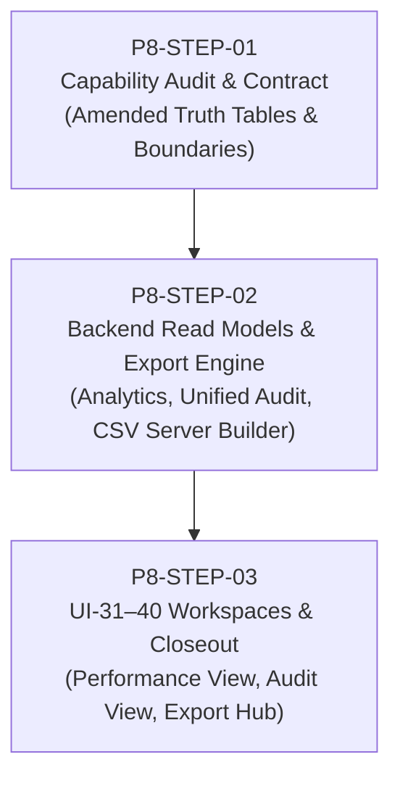

# Rate & Revenue Phase 8 — Implementation Plan (Amended)
**Document ID:** `docs/pms/rate-revenue-phase8-plan.md`  
**Phase:** 8 (Analytics, Audit & Export)  
**Status:** In Progress (Step 1 Complete)  
**Branch:** `feature/guest-preferences-workspace`

---

## Overview

Phase 8 completes the Rate & Revenue operational suite by delivering:
- **Revenue Analytics:** Deep operational visibility, room type and rate plan breakdowns, commercial attribution, stay-date time series, and lead-time analytics.
- **Audit & Control:** Unified operational audit logging across Rates, Restrictions, Commercial actions, and Approvals.
- **Export:** Standardized RFC-4180 compliant CSV export workflows for analytics and audit logs.

---

## 3-Step Execution Plan

### Step 1: P8-STEP-01 — Analytics + Audit + Export Capability Audit & Contract
*Status: COMPLETE*
- Executed capability audit across NORU codebase incorporating all 19 amendment directives.
- Preserved existing Control Center Booked Room Revenue semantics:
  *"Booked Room Revenue uses the existing Rate & Revenue / Control Center reservation pricing semantics. Phase 8 must preserve that formula rather than redefine it."*
- Established Cashiering ownership vs. read-only consumption boundary (Stay-date rate yield remains strictly based on Booked Room Revenue).
- Preserved existing inventory denominator (`active hotel_rooms count × days`) and documented OOO/OOS room limitations.
- Enforced absolute prohibition of fake inventory denominators for Rate Plans, Segments, Sources, Channels, Promos, and Packages (Occupancy% and RevPAR marked NOT MEANINGFUL).
- Declared: `UI-31–40 exact mapping: BLOCKED — original source documentation unavailable` (workspace placeholders evaluated as scaffolding only).
- Verified RFC-4180 CSV export infrastructure; mandated server-complete generation for paginated datasets.
- Created `docs/pms/rate-revenue-phase8-analytics-audit.md`.

---

### Step 2: P8-STEP-02 — Backend Read Models + Unified Audit + Export Foundation
*Status: COMPLETE*

**Key Deliverables:**
1. **Revenue Analytics Server Functions (`src/packages/pms/lib/revenue/revenue-analytics.server.ts` & `.functions.ts`):**
   - `getRevenuePerformanceOverview`: Batched reader for Booked Room Revenue, Sold Nights, Available Nights, Occupancy %, ADR, RevPAR, stay-date daily time series, and room type / rate plan breakdowns. Strictly preserves `rates.functions.ts` stay-date allocation logic.
   - `getCommercialPerformance`: Attribution reader for active promotions and package selections from Phase 5 tables.
2. **Unified Revenue Audit Server Functions (`src/packages/pms/lib/revenue/revenue-audit.server.ts` & `.functions.ts`):**
   - `getUnifiedRevenueAudit`: Queries and normalizes rows from all 4 immutable audit tables (`hotel_rate_change_events`, `hotel_rate_restriction_change_events`, `hotel_commercial_change_events`, `hotel_revenue_approval_events`), resolves staff actor names in batches, and provides server-side pagination and domain filtering.
   - `getAuditOperationDetail`: Granular diff reader returning all state changes for an `operation_id`.
3. **Export Server Builders (`src/packages/pms/lib/revenue/revenue-export.server.ts` & `.functions.ts`):**
   - `exportRevenuePerformanceCsv`: Generates full server-filtered CSV strings for breakdown datasets.
   - `exportUnifiedAuditCsv`: Generates complete server-filtered CSV strings for audit queries.
4. **Backend Test Suite:**
   - Dedicated unit and integration tests verifying weighted ADR/RevPAR arithmetic, date boundary clamping, unpriced booking handling, staff label resolution, and pagination.

---

### Step 3: P8-STEP-03 — UI-31–40 Workspaces & Rate & Revenue Final Closeout
*Status: PENDING*

**Key Deliverables:**
1. **Revenue Performance View (`src/packages/pms/components/rates/analytics/revenue-performance-view.tsx`):**
   - Overview KPIs (Booked Room Revenue, Sold Nights, Available Nights, Occupancy %, ADR, RevPAR, Priced Share).
   - Stay-date daily revenue and occupancy trend chart.
   - Breakdown subviews: Room Types, Rate Plans (Volume/Revenue/ADR only), Segments & Sources, Commercial (Promotions & Packages).
   - Non-intrusive data quality warnings for unpriced bookings and legacy unassigned segments.
2. **Audit & Control View (`src/packages/pms/components/rates/audit/revenue-audit-view.tsx`):**
   - Master audit table with pagination, search, actor filters, and domain badges (Rates, Restrictions, Commercial, Approvals).
   - Operation detail drawer showing exact before/after diffs linked by `operation_id` or `applied_operation_id`.
3. **Export Workflow (`src/packages/pms/components/rates/export/revenue-export-dialog.tsx`):**
   - Export modal / trigger buttons generating validated CSV downloads with server-complete datasets.
4. **Workspace Wiring & Closeout:**
   - Mount views in `src/packages/pms/components/workspaces/rates-workspace.tsx`.
   - Update `src/packages/pms/lib/rate-revenue-workspace.ts`: flip `implemented: true` for `revenue-performance`, `audit-control`, and `export`.
   - Run end-to-end regression tests and create Phase 8 completion documentation.
