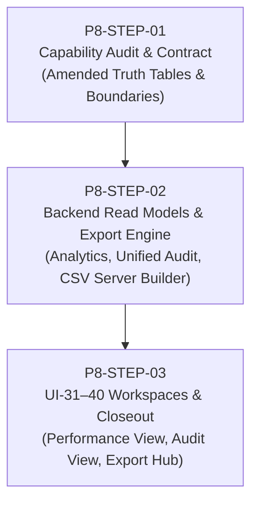

# Rate & Revenue Phase 8 — Implementation Plan (Amended)
**Document ID:** `docs/pms/rate-revenue-phase8-plan.md`  
**Phase:** 8 (Analytics, Audit & Export)  
**Status:** In Progress (Step 1 Complete)  
**Branch:** `feature/guest-preferences-workspace`

---

## Overview

Phase 8 completes the Rate & Revenue operational suite by delivering:
- **Revenue Analytics:** Deep operational visibility, room type and rate plan breakdowns, commercial attribution, stay-date time series, and lead-time analytics.
- **Audit & Control:** Unified operational audit logging across Rates, Restrictions, Commercial actions, and Approvals.
- **Export:** Standardized RFC-4180 compliant CSV export workflows for analytics and audit logs.

---

## 3-Step Execution Plan

### Step 1: P8-STEP-01 — Analytics + Audit + Export Capability Audit & Contract
*Status: COMPLETE*
- Executed capability audit across NORU codebase incorporating all 19 amendment directives.
- Preserved existing Control Center Booked Room Revenue semantics:
  *"Booked Room Revenue uses the existing Rate & Revenue / Control Center reservation pricing semantics. Phase 8 must preserve that formula rather than redefine it."*
- Established Cashiering ownership vs. read-only consumption boundary (Stay-date rate yield remains strictly based on Booked Room Revenue).
- Preserved existing inventory denominator (`active hotel_rooms count × days`) and documented OOO/OOS room limitations.
- Enforced absolute prohibition of fake inventory denominators for Rate Plans, Segments, Sources, Channels, Promos, and Packages (Occupancy% and RevPAR marked NOT MEANINGFUL).
- Declared: `UI-31–40 exact mapping: BLOCKED — original source documentation unavailable` (workspace placeholders evaluated as scaffolding only).
- Verified RFC-4180 CSV export infrastructure; mandated server-complete generation for paginated datasets.
- Created `docs/pms/rate-revenue-phase8-analytics-audit.md`.

---

### Step 2: P8-STEP-02 — Backend Read Models + Unified Audit + Export Foundation
*Status: COMPLETE*

**Key Deliverables:**
1. **Revenue Analytics Server Functions (`src/packages/pms/lib/revenue/revenue-analytics.server.ts` & `.functions.ts`):**
   - `getRevenuePerformanceOverview`: Batched reader for Booked Room Revenue, Sold Nights, Available Nights, Occupancy %, ADR, RevPAR, stay-date daily time series, and room type / rate plan breakdowns. Strictly preserves `rates.functions.ts` stay-date allocation logic.
   - `getCommercialPerformance`: Attribution reader for active promotions and package selections from Phase 5 tables.
2. **Unified Revenue Audit Server Functions (`src/packages/pms/lib/revenue/revenue-audit.server.ts` & `.functions.ts`):**
   - `getUnifiedRevenueAudit`: Queries and normalizes rows from all 4 immutable audit tables (`hotel_rate_change_events`, `hotel_rate_restriction_change_events`, `hotel_commercial_change_events`, `hotel_revenue_approval_events`), resolves staff actor names in batches, and provides server-side pagination and domain filtering.
   - `getAuditOperationDetail`: Granular diff reader returning all state changes for an `operation_id`.
3. **Export Server Builders (`src/packages/pms/lib/revenue/revenue-export.server.ts` & `.functions.ts`):**
   - `exportRevenuePerformanceCsv`: Generates full server-filtered CSV strings for breakdown datasets.
   - `exportUnifiedAuditCsv`: Generates complete server-filtered CSV strings for audit queries.
4. **Backend Test Suite:**
   - Dedicated unit and integration tests verifying weighted ADR/RevPAR arithmetic, date boundary clamping, unpriced booking handling, staff label resolution, and pagination.

---

### Step 2B: P8-STEP-02B — Backend Correctness Fixes Before UI Implementation
*Status: COMPLETE*

**Key Correctness Fixes:**
1. **Dedicated Complete Audit Export Path (`loadUnifiedRevenueAuditForExport`):**
   - Unified audit CSV export uses an independent, unpaginated server loader (`loadUnifiedRevenueAuditForExport`) instead of the paginated UI reader.
   - UI pagination remains strictly clamped to `MAX_AUDIT_PAGE_SIZE = 100`.
   - Complete CSV export streams all matching records up to `MAX_AUDIT_EXPORT_ROWS = 10,000` without intermediate pagination boundaries.
   - If matching rows exceed 10,000, explicitly throws `AUDIT_EXPORT_TOO_LARGE` rather than silently truncating.
2. **Room Type Breakdown Under Non-Inventory Dimension Filters:**
   - When any non-inventory dimension filter is active (`ratePlanId`, `marketSegmentId`, `commercialSourceId`, `technicalOrigin`), Room Type breakdown rows set `availableRoomNights = null`, `occupancyPct = null`, `revpar = null`, and `inventoryMetricSupport = "NOT_MEANINGFUL"`.
   - ADR remains valid (`bookedRoomRevenue / soldRoomNights`).
   - When filtering solely by property or `roomTypeId`, Room Type inventory metrics remain fully supported.
3. **Defense Against Mixed-Currency Monetary Aggregation:**
   - Because NORU has no authoritative FX conversion engine, monetary values across differing currencies must never be summed.
   - If any included priced reservation has a currency different from property currency, throws `REVENUE_ANALYTICS_MIXED_CURRENCY`.
4. **Unsupported Sales Channel Filter Protection:**
   - Because no stable `salesChannelId` linkage exists on `hotel_reservations`, passing a non-null `salesChannelId` explicitly throws `REVENUE_ANALYTICS_SALES_CHANNEL_UNSUPPORTED` instead of silently ignoring the filter.

---

### Step 3: P8-STEP-03 — UI-31–40 Workspaces & Rate & Revenue Final Closeout
*Status: COMPLETE*

**Key Deliverables:**
1. **Revenue Performance Workspace (`src/packages/pms/components/rates/analytics/revenue-performance-view.tsx`):**
   - **UI-31 — Revenue Performance:** Executive overview KPIs (`revenue-kpi-strip.tsx`), trend preview, top segment/source previews, and data quality alerts (`revenue-data-quality-alert.tsx`).
   - **UI-32 — Occupancy / ADR / RevPAR:** Operational KPI formulas and dense room-type breakdown table (`revenue-kpi-detail.tsx`). Enforces non-inventory denominator nullification (`N/A`).
   - **UI-33 — Revenue by Segment:** Commercial market segment attribution table (`revenue-segment-breakdown.tsx`) with unassigned/legacy row indicators and contextual detail drawer.
   - **UI-34 — Revenue by Source:** Dual tabs for Commercial Booking Sources and Technical Origins (`revenue-source-breakdown.tsx`). Sales channel is omitted; commission models are disclaimed.
   - **UI-35 — Revenue Trends:** Recharts time series (`revenue-trend-view.tsx`) with metric dropdown (Revenue, Sold Nights, Occupancy %, ADR, RevPAR) and Daily/Weekly/Monthly rollup (strictly avoids double-counting reservation counts by aggregating additive nightly metrics only).
   - **Commercial Performance:** Promotions and packages attribution section (`commercial-performance-section.tsx`).
2. **Audit & Control Workspace (`src/packages/pms/components/rates/audit/revenue-audit-view.tsx`):**
   - **UI-36 — Revenue Control History:** Unified 4-source audit master table with domain badges, date range filter, action filter, actor filter, live text search, and server-side pagination (10, 25, 50 rows).
   - **UI-37 — Rate Audit:** Filtered rates domain subview.
   - **UI-38 — Restriction Audit:** Filtered restrictions domain subview.
   - **UI-39 — Override Audit:** Filtered override/exception events subview backed by server-side `domain: "overrides"` filtering (Amendment 1).
   - **Audit Detail Drawer (`revenue-audit-detail-drawer.tsx`):** Granular diff matrix, state transitions, and linked approval lineage (`Submitted -> Approved -> Applied Operation`).
3. **Revenue Export Workspace (`src/packages/pms/components/rates/export/revenue-export-view.tsx`):**
   - **UI-40 — Revenue Export:** Controlled cards for Revenue Performance Overview CSV, Commercial Performance CSV, and Unified Revenue Audit CSV. Client Blob download, pending mutation spinners, toast notifications, and `AUDIT_EXPORT_TOO_LARGE` safety handling.
4. **Workspace Wiring & Route Integration:**
   - Mounted `RevenuePerformanceView`, `RevenueAuditView`, and `RevenueExportView` in `src/packages/pms/components/workspaces/rates-workspace.tsx`.
   - Updated `src/packages/pms/lib/rate-revenue-workspace.ts`: marked `revenue-performance`, `audit-control`, and `export` as `implemented: true`.
   - Updated `REVENUE_UI_SCREEN_MAP` to reflect exact UI-31–40 source-of-truth mappings.
   - Verified 38 tests across 5 test suites pass with 0 failures. ESLint: 0 errors.
