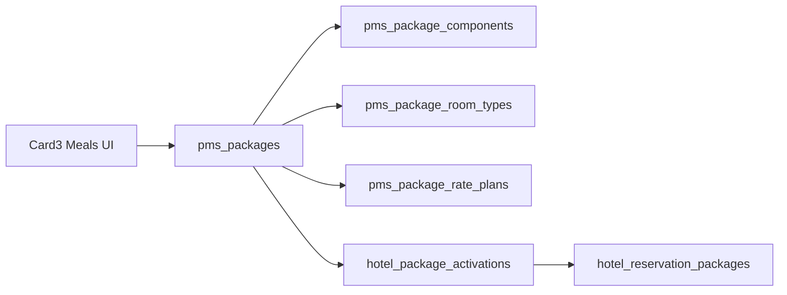

# Package Master refactor (audit + plan)

**Deliverable after approval:** write [`package-master-refactor-plan.md`](noru-company-working/package-master-refactor-plan.md) (this document). Do not implement product code, migrations, or apply SQL in that step unless Abel asks.

Worktree: [`noru-company-working/`](noru-company-working/). Highest sequential migration file: [`0123_pms_cancellation_policy_rules.sql`](noru-company-working/drizzle/migrations/0123_pms_cancellation_policy_rules.sql). **Next number: `0124`.** Dual-lane copies required. **Collision:** two `0120_*` files exist (`pms_package_rate_plan_inclusion` and `pms_card3_company_contracts_foundation`); apply order must stay explicit.



---

## 1. Current state audit

### Package master

- **Canonical table:** `public.pms_packages` from [`0049_pms_set3_rates_guest_rules.sql`](noru-company-working/drizzle/migrations/0049_pms_set3_rates_guest_rules.sql); additive columns in [`0072_pms_card3_meal_plans_packages.sql`](noru-company-working/drizzle/migrations/0072_pms_card3_meal_plans_packages.sql).
- **Columns today:** `id`, `restaurant_id`, `type`, `code`, `name`, `active`, `inclusion` (legacy JSON), `description`, `package_price`, timestamps. Unique `(restaurant_id, code)`.
- **Generated types:** [`src/integrations/supabase/types.ts`](noru-company-working/src/integrations/supabase/types.ts) `pms_packages` matches those columns (no image, no charge_basis).
- **Canonical Settings writer:** `savePackageCard3` in [`meals-card3.functions.ts`](noru-company-working/src/packages/pms/lib/meals-card3.functions.ts) (code, name, type, description, package_price, active, room/rate maps).
- **Orphan writer:** `savePmsPackage` in [`pms-set3-rates-guest.functions.ts`](noru-company-working/src/packages/pms/lib/pms-set3-rates-guest.functions.ts) still writes SET3 `inclusion` JSON only (no price, no links). UI: [`pms-set3-section.tsx`](noru-company-working/src/packages/pms/components/settings/pms-set3-section.tsx).
- **Incomplete:** no cover image; no charge_basis; `inclusion` JSON unused by Card 3; SET3 editor can diverge from Card 3.
- **Missing vs target:** configurable category master, media, charge basis, free-text includes.

### Categories

- **Exists:** `pms_packages.type` CHECK enum `accommodation | business | romantic | conference | custom` ([`PACKAGE_TYPES`](noru-company-working/src/packages/pms/lib/pms-set3-rates-guest.ts)). Not a master table. Not free-text.
- **UI:** Type column + labels in [`pms-property-setup-card3-meals.tsx`](noru-company-working/src/packages/pms/components/settings/pms-property-setup-card3-meals.tsx).
- **Reservation cards** map `typeLabel` as “category” in [`reservation-detail-packages.ts`](noru-company-working/src/packages/pms/lib/reservation-detail-packages.ts).
- **Incomplete:** enum cannot represent Spa / Transfer / Tour without `custom` or CHECK change.
- **Missing:** tenant-configurable category table (only needed if PM wants categories beyond extending the enum).

### Pricing

- **Master price:** `pms_packages.package_price numeric(12,2) >= 0`, default 0. Property currency via `restaurants.currency_code` (snapshot `currencyCode` in `MealsCard3Snapshot`). No currency column on the package.
- **Charge basis:** **not** on `pms_packages`. Lives on `hotel_package_activations.charge_basis` and `hotel_reservation_packages.charge_basis` with CHECK **`= 'per_stay'` only** ([`0104_pms_commercial_engine_foundation.sql`](noru-company-working/drizzle/migrations/0104_pms_commercial_engine_foundation.sql), [`COMMERCIAL_V1_PACKAGE_CHARGE_BASIS`](noru-company-working/src/packages/pms/lib/revenue/commercial-engine.ts)). Engine rejects other bases (`PACKAGE_CHARGE_BASIS_UNSUPPORTED`).
- **Can current pricing represent target bases?** Setup figure is a single amount. Execution: **per_stay only**. per_night / per_person / per_person_per_night / per_room / per_room_per_night / fixed are **not** executable. Display helper [`chargeTypeLabel`](noru-company-working/src/packages/pms/lib/reservation-detail-packages.ts) maps `per_night` loosely to “Per Room Per Night” but nothing stores those values on the master.
- **Readiness:** [`evaluateMealsCard3Readiness`](noru-company-working/src/packages/pms/lib/meals-card3.server.ts) requires `packagePrice > 0` (zero-price packages cannot complete Card 3).

### Media

- **Package cover:** none (no column, no storage path, no upload in meals UI).
- **Reusable infra:** bucket `property-images` (`ROOM_BUCKET`), `signRoomImages`, `roomTypeImagePath` in [`rooms.server.ts`](noru-company-working/src/packages/pms/lib/rooms.server.ts). Room types / guests / Card 1 already upload via signed URLs. **Safe reuse** if new paths stay namespaced, e.g. `{restaurantId}/packages/{packageId}/cover.{ext}` (do not share room-type folders).
- **Reservation Detail** `coverUrl` is **room** cover, not package art ([`reservation-detail-packages.tsx`](noru-company-working/src/packages/pms/components/workspaces/reservation-detail-packages.tsx)).

### Includes / components

- **Table:** `pms_package_components` (0072). Kinds: `meal_plan | room_amenity | fo_service`. Exactly one FK populated. `quantity > 0`, `sort_order >= 0`. **No** `name`, **no** `description`.
- **Linked, not free-text.** Labels come from meal plan / amenity / FO service names (`sourceLabel` in snapshot). Activation snapshot in 0107 joins meal plans and amenities; FO service label can fall back to `component_kind`.
- **Writers:** `savePackageComponentCard3` / `deletePackageComponentCard3`. Validation: [`isValidPackageComponent`](noru-company-working/src/packages/pms/lib/meals-card3.server.ts).
- **Legacy:** `pms_packages.inclusion` JSON kept; Card 3 does not migrate it.
- **Incomplete vs target examples:** “Welcome Drink”, “Late Checkout”, “Airport → Hotel” require an FO-service (or amenity) row **or** a new custom kind.
- **Ordered + quantity-aware:** yes.

### Room-type applicability

- **Table:** `pms_package_room_types` (0072). Unique `(package_id, room_type_id)`. Empty set = commercial engine **allow all** (`PACKAGE_EMPTY_MASTER_SCOPE_ALLOW_ALL`). Settings copy: “All / none assigned” (ambiguous).
- **Saved in** `savePackageCard3` (delete-all + insert).

### Rate-plan applicability

- **Table:** `pms_package_rate_plans` + **`inclusion_type`** (`included | optional`, default `optional`) from [`0120_pms_package_rate_plan_inclusion.sql`](noru-company-working/drizzle/migrations/0120_pms_package_rate_plan_inclusion.sql). Types.ts already has `inclusion_type`. Writer persists it with fail-soft if column missing (`42703` / `PGRST204`).
- **Used:** Settings lists “Package rate plan types”; [`rate-plan-package-inclusion.ts`](noru-company-working/src/packages/pms/lib/rate-plan-package-inclusion.ts) partitions included vs optional for rate merchandising (Create Reservation §5). Comment: does **not** change `price_hotel_stay` or folio.
- **Empty links:** engine treat as all rate plans.

### Reservation consumption

- **Detail Packages tab:** loads catalogue via `getMealsCard3`, eligible activations via `listEligiblePackageActivations`, applied rows via `getReservationCommercialAttribution`. Add/remove **toasts** `PACKAGE_BIND_GAP_COPY`. **No Detail writer.** Applied packages come from `hotel_reservation_packages` (commercial create RPC), not from a tab mutation.
- **New Reservation UI:** [`CreateReservationPackages`](noru-company-working/src/packages/pms/components/bookings/create-reservation-packages.tsx) is a **gated honesty box**. Bind is **OUT** of the page ([`create-reservation-phase1-section8.ts`](noru-company-working/src/packages/pms/lib/create-reservation-phase1-section8.ts)). Browser does **not** send `packageActivationIds`.
- **Server create:** `createReservation` **can** pass `packageActivationIds` into `create_hotel_reservation_priced_commercial`. That is an API capability, not wired from New Reservation UI.
- **Rates & Revenue Packages view:** operational **activations** ([`packages-view.tsx`](noru-company-working/src/packages/pms/components/rates/packages/packages-view.tsx) + [`package-detail-drawer.tsx`](noru-company-working/src/packages/pms/components/rates/packages/package-detail-drawer.tsx)) — not Settings Package Master. Keep it; do not merge into Settings.

### Canonical Settings UI vs duplicates

- **Canonical definition UI:** Card 3 Meal Plans & Packages — [`pms-property-setup-card3-meals.tsx`](noru-company-working/src/packages/pms/components/settings/pms-property-setup-card3-meals.tsx) (`CARD3_PACKAGES_HREF`). One scroll with three **list sections**: Packages, Package rate plan types, Package Components (`CARD3_MEALS_TABS` is unused).
- **Duplicates / orphans:** SET3 package dialog (`savePmsPackage`); Rate & Revenue activation drawer (correctly operational). No second package master table.

### Answers to the 20 audit questions

1. Canonical table: `pms_packages`.
2. Fields: type, code, name, active, inclusion JSON, description, package_price.
3. Category: CHECK enum `type`, not a master, not free-text.
4. Price: `package_price` in property currency.
5. Charge types: executable `per_stay` only (activations/attributions).
6. Target bases: **not** representable in engine; master has no charge_basis column.
7. Components: `pms_package_components`.
8. Linked + `component_kind`; ordered; quantity-aware; not free-text; no description.
9. Links: `pms_package_rate_plans`.
10. `inclusion_type` present, persisted, used in Settings + rate merchandising; not in room rate math.
11. Room types: `pms_package_room_types`; empty = all.
12. Package media: no.
13. `property-images` reusable with a packages path prefix.
14. Detail: `getMealsCard3` + eligible activations + commercial attribution.
15. Detail add/remove writer: **no**.
16. New Reservation bind at create: **UI no**; server RPC optional if IDs passed.
17. Canonical Settings: Card 3 meals file.
18. Orphan: SET3 `savePmsPackage`; operational drawer is not a definition editor.
19. Unify at UI with **no** schema: one Package editor shell; Includes from existing components; applicability already on `savePackageCard3`; hide duplicate lists; optionally deprecate SET3 package form.
20. Schema needed for: cover image path; optional charge_basis on master; optional custom include kind/label/description; optional category enum/table expansion. **Not** needed for a second package table.

---

## 2. Gap analysis

- **Schema:** cover path; charge_basis on master (and later activation CHECKs if execution expands); optional custom component columns/kind; optional category expansion. No new package master table.
- **Server/read model:** `PackageCard3Row` lacks image, chargeBasis, component descriptions. Component read has no free-text label. Activation apply SQL snapshots components without FO service names.
- **UI:** three lists instead of one editor; SET3 duplicate; no media; charge basis not editable on master.
- **Validation:** Card 3 readiness blocks zero-price packages; components must link a catalogue row.
- **Pricing semantics:** setup amount vs V1 per_stay execution; inclusion_type is merchandising only.
- **Media:** missing.
- **Reservation integration:** display partial (no image; charge type from activation or em dash); add/remove not persisted; create UI ungated bind.
- **Testing:** [`meals-card3.test.ts`](noru-company-working/src/packages/pms/lib/meals-card3.test.ts), [`rate-plan-package-inclusion.test.ts`](noru-company-working/src/packages/pms/lib/rate-plan-package-inclusion.test.ts), [`reservation-detail-packages.test.ts`](noru-company-working/src/packages/pms/lib/reservation-detail-packages.test.ts), [`create-reservation-phase1-section8.test.ts`](noru-company-working/src/packages/pms/lib/create-reservation-phase1-section8.test.ts), commercial-package tests. No Package Master editor tests yet.
- **Deployment:** dual-lane `0124`; fail-soft if 0120 inclusion not applied (already in writer); types.ts regen after schema; **do not apply from agent**.

---

## 3. Recommended target data model (minimum)

Prefer extend-in-place.

- **Package:** keep `pms_packages`. Add nullable `cover_image_path text` (storage path, not public URL). Add `charge_basis text NOT NULL DEFAULT 'per_stay'` with CHECK of allowed setup values; **do not unlock engine CHECKs in the same migration unless approved**.
- **Category:** keep `type` as category. Prefer extending `PACKAGE_TYPES` + CHECK over a new table unless PM needs tenant-defined categories.
- **Price:** keep `package_price`; currency remains property `currency_code`.
- **Cover image:** path on master; signed URLs via existing `signRoomImages`.
- **Includes:** keep `pms_package_components`. Default: continue linked kinds. If free-text includes are required: add `component_kind = 'custom'` plus `label` (required for custom) and optional `description`; keep XOR source_check. Do **not** invent a second includes table.
- **Room types:** keep `pms_package_room_types`; empty = all.
- **Rate plans:** keep `pms_package_rate_plans.inclusion_type` (`included` | `optional`).
- **Activations:** remain snapshots; Settings does not write `hotel_package_activations`.

---

## 4. Phased implementation

**Recommended order:** **B → E → F → C → D → G**.

Why not C/D first: 80% of the target editor is already persisted (basic info, includes, room/rate links, inclusion_type). Unifying Settings first avoids a migration while the UX is still three lists. Media and charge-basis are the only hard schema cuts. G last so reservations consume a stable master DTO.

If Abel prefers schema-first, swap C+D before E/F; product behavior of Settings still requires B.

### Phase B — Unified Package Master UI shell

- **Goal:** One editor (Basic Information + placeholders for later sections) for create/edit; list of packages only; remove standalone “Package rate plan types” and “Package Components” as peer lists (or collapse to read-only until E/F).
- **Migration:** no.
- **Files:** [`pms-property-setup-card3-meals.tsx`](noru-company-working/src/packages/pms/components/settings/pms-property-setup-card3-meals.tsx), [`meals-card3.server.ts`](noru-company-working/src/packages/pms/lib/meals-card3.server.ts) (`CARD3_MEALS_TABS`), [`meals-card3.test.ts`](noru-company-working/src/packages/pms/lib/meals-card3.test.ts). Optionally retire SET3 package CRUD from [`pms-set3-section.tsx`](noru-company-working/src/packages/pms/components/settings/pms-set3-section.tsx) / `savePmsPackage` (link to Card 3 instead).
- **Server:** none required; keep `savePackageCard3`.
- **Validation:** existing package schema.
- **Tests:** meals UI source tests: single Add/Edit package flow; SET3 no longer mutating catalogue if retired.
- **AC:** operator edits one package record with code/name/type/description/active/price in one sheet; no second package master.
- **Non-goals:** media, new charge bases, reservation bind, Rate & Revenue activation UI.

### Phase E — Includes inside Package editor

- **Goal:** Nested includes CRUD on the same package sheet; reuse `savePackageComponentCard3`.
- **Migration:** only if custom/free-text kind is approved.
- **Files:** meals UI; [`meals-card3.functions.ts`](noru-company-working/src/packages/pms/lib/meals-card3.functions.ts); tests.
- **AC:** unlimited linked components with kind, source, quantity, sort; empty includes allowed in editor (readiness rule separately).
- **Non-goals:** changing commercial snapshot math.

### Phase F — Room type + rate plan applicability in editor

- **Goal:** Move room-type multi-select and per-rate-plan `included|optional` fully into the package sheet; delete the derived “Package rate plan types” list.
- **Migration:** no (0120 already shipped in repo).
- **Files:** meals UI; `savePackageCard3` already writes maps.
- **AC:** All vs selected room types; all vs selected rate plans; inclusion_type per link; empty = all (copy must say so).
- **Non-goals:** changing quote/folio for `included`.

### Phase C — Package media

- **Goal:** Cover preview, upload, replace, remove.
- **Migration:** **yes** `0124` (or later if D shares a file): `cover_image_path`. Dual-lane. Fail-soft reads if column missing (Card 3 pattern).
- **Server:** signed upload ticket + `signRoomImages`; path helper `packageCoverPath`.
- **UI:** cover block in Package Master.
- **AC:** replace/remove clears path; missing image shows placeholder; deleted object fail-soft.
- **Non-goals:** galleries, CDN, public buckets.

### Phase D — Pricing / charge-basis capability

- **Goal:** Persist charge basis on the **master** for setup/display; keep execution `per_stay` until a **separate** commercial-engine approval.
- **Migration:** `charge_basis` on `pms_packages` with CHECK of target set; default `per_stay`; backfill existing rows. **Do not** widen `hotel_package_activations` / `hotel_reservation_packages` CHECKs in this phase unless approved.
- **Server:** `PackageCard3Row.chargeBasis`; save validation.
- **UI:** amount + inherited currency + charge basis select.
- **AC:** zero allowed if PM drops readiness `> 0`; non-per_stay packages remain ineligible for V1 quote (`PACKAGE_CHARGE_BASIS_UNSUPPORTED`) until engine phase.
- **Non-goals:** occupancy-based quoting, per-person math, folio posting changes.

### Phase G — Reservation consumption polish

- **Goal:** Detail cards show cover, name, category, description, includes, price, charge basis, applicability from master + attribution. **Do not fake add/remove.**
- **Migration:** no (unless G is explicitly scoped to bind).
- **Files:** [`reservation-detail-packages.ts(x)`](noru-company-working/src/packages/pms/components/workspaces/reservation-detail-packages.tsx), tests. Optional follow-on: New Reservation bind using existing `packageActivationIds` — **requires product approval** (Section 8 currently locked bind OUT).
- **AC:** applied rows still from attribution; available cards from catalogue; add/remove still honest gap **or** real writer if approved.
- **Non-goals:** Settings ownership moving to reservations.

---

## 5. Migration plan

- **Needed?** Phase B/E/F/G (display-only): **no**. Phase C and D: **yes**. Custom includes / extra categories: **yes** if approved.
- **Next number:** `0124` in both [`drizzle/migrations`](noru-company-working/drizzle/migrations) and [`supabase/migrations`](noru-company-working/supabase/migrations), byte-identical.
- **Dual-lane:** required. Do not apply both copies to one DB. **Do not apply from agent.**
- **Defaults/backfill:** `charge_basis = 'per_stay'`; `cover_image_path NULL`; existing components unchanged; `inclusion` JSON untouched.
- **Compatibility:** writers already fail-soft missing `inclusion_type`; mirror that for new columns. Activation apply copies master price/type/components at CREATE — new master charge_basis will **not** flow until 0107/activation SQL is updated (call that out in D).
- **Fail-soft:** missing column → omit image/basis in reads; do not crash Settings.
- **0120 collision:** document apply sequence; do not reuse `0120`.

---

## 6. Data contracts (proposed DTOs)

```ts
type PackageMaster = {
  id: string;
  code: string;
  name: string;
  category: PackageType; // pms_packages.type
  description: string;
  active: boolean;
  pricing: PackagePricing;
  media: PackageMedia;
  components: PackageComponent[];
  applicability: PackageApplicability;
};

type PackagePricing = {
  amount: number; // package_price
  currencyCode: string; // restaurants.currency_code
  chargeBasis: "per_stay" | "per_night" | "per_person" | "per_person_per_night" | "per_room" | "per_room_per_night" | "fixed";
};

type PackageComponent = {
  id: string;
  kind: "meal_plan" | "room_amenity" | "fo_service" | "custom"; // custom only if approved
  sourceId: string | null;
  sourceLabel: string;
  description: string | null;
  quantity: number;
  sortOrder: number;
};

type PackageApplicability = {
  roomTypeMode: "all" | "selected";
  roomTypeIds: string[];
  ratePlanMode: "all" | "selected";
  ratePlanLinks: { ratePlanId: string; inclusionType: "included" | "optional" }[];
};

type PackageMedia = {
  coverImagePath: string | null;
  coverImageUrl: string | null; // signed, ephemeral
};
```

Map empty `roomTypeIds` / `ratePlanLinks` → `all`.

---

## 7. Edge cases

- **Zero-priced:** allowed in DB (`>= 0`); Card 3 readiness currently blocks; decide in D.
- **Inactive:** catalogue filter; engine `PACKAGE_INACTIVE`; Detail `packageAppliesToStay` requires `active`.
- **All vs selected room/rate:** empty link tables = all in engine; UI must not say “none assigned”.
- **Included vs optional:** merchandising only; default optional on 0120 backfill.
- **No components:** allowed in DB; readiness currently requires ≥1 valid component.
- **Many components:** sort_order; editor list, not a new table.
- **Missing image:** placeholder; `coverImageUrl` null.
- **Deleted cover object:** signed URL fail → placeholder; path may still be set until remove.
- **Pricing basis change:** master update does **not** rewrite existing activations/attributions (0104 snapshot).
- **Legacy `inclusion` JSON:** leave; do not backfill into components.
- **No rate-plan links:** all plans eligible.
- **Duplicate component labels:** allowed (no unique on label); uniqueness is (package, kind, source) not enforced — duplicate meal_plan links possible; optional unique later.
- **SET3 vs Card 3:** SET3 save can overwrite type/code/name/active without price/links.

---

## 8. Reservation integration

**Display (G):** cover (signed), name, category (`typeLabel`), description, include labels, price (`package_price` or activation `configuredPrice`), charge basis (activation today; master after D), applicability (room/rate ids from master or activation scope).

**Add/remove today:** **does not persist** on Detail. Copy: packages cannot be attached or removed from that workspace.

**Create:** UI gated; `createReservation` RPC can attach activations if IDs provided. Wiring the New Reservation picker is a **product unlock**, not implied by Package Master Settings.

Reservations remain consumers; Settings remains definition owner.

---

## 9. Test plan (focused)

- meals-card3: snapshot mapping, save package + links + inclusion_type fail-soft, component XOR, readiness.
- New editor: one sheet contains includes + applicability; peer lists gone.
- Media: path helper namespace; remove clears path (after C).
- Charge basis: default per_stay; invalid rejected; engine still per_stay until unlocked.
- reservation-detail-packages: still no insert to `hotel_reservation_packages` from the tab unless G bind is approved.
- create-reservation-section8: keep bind-out tests until bind is explicitly in scope.
- commercial-package: empty master scope = all; inclusion_type not required for eligibility.

No full `tsc`/build; no browser automation in this audit.

---

## 10. Risks / approvals

Decisions **before** implementation:

1. **Category:** extend `PACKAGE_TYPES` CHECK vs new category master vs keep enum and map examples onto `custom`.
2. **Free-text includes:** stay linked-only vs add `custom` + label/description.
3. **Charge basis:** Settings-only column vs unlocking commercial engine + activation CHECKs (pricing, occupancy, folio).
4. **Zero-price / no-component readiness:** relax Card 3 blockers or keep.
5. **Retire SET3 `savePmsPackage`** (recommended) vs leave duplicate writer.
6. **New Reservation bind:** keep Section 8 gate vs wire `packageActivationIds`.
7. **Detail add/remove writer:** stay honesty-gap vs new commercial reevaluate RPC.
8. **Migration apply:** 0124 dual-lane after merge; do not apply from agent; 0120 filename collision awareness.

Architectural lock: **do not** create a second package master or a parallel includes table for UI sections.
